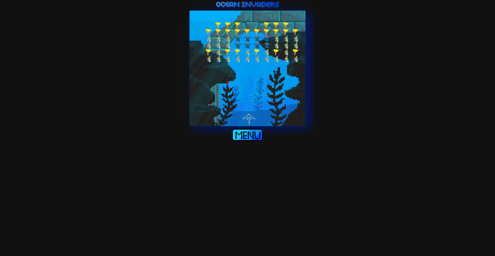

# Ocean Invaders

Welcome to Ocean Invaders, a retro-style 2D space shooter game!

## Game Overview

Ocean Invaders is a classic space shooter game where you control a player spaceship and face waves of enemy fish. Your objective is to destroy all enemy fish and survive as long as possible. The game has multiple levels, each with increasing difficulty.

## How to Play

- Use the arrow keys on your keyboard to move the Manta Ray left and right.
- Press the Spacebar to shoot bullets and destroy enemy fish.
- Avoid getting hit by fish bullets or colliding with enemy fish, as it will result in a game over.

## Game Features

- Responsive 2D graphics using HTML5 canvas and 2D drawing context.
- Retro pixel art style background and character design.
- Dynamic sound effects for bullet firing and enemy explosions.
- High scores: Save your initials and scores to compete with other players.
- Music: Enable or disable background music during the game.

## How to Start

To start playing Ocean Invaders, simply click on the "Start" button on the main menu. You will be taken to the game screen, where you can begin your ocean adventure. Use the arrow keys to navigate your player and the Spacebar to shoot bullets at the enemy.

## Game Over and Winners Tab

If you manage to defeat all enemy fish in a level, you will progress to the next level. If you get hit by an enemy bullet or collide with an enemy fish, it's game over. When you win you can save your initials to the winners tab.

## Controls

- Arrow Keys: Move player left or right.
- Spacebar: Shoot bullets.

## Credits

- Developed by Nick Heal, Kenneth Westbrook, Leo Quijano II
- Graphics and sound effects from various sources (credited in the game files).
- Font "pixel" by DaFont
- Font "broken" by DaFont
- Youtube API
- BackSplash API

## Technical Details

- The game is built using HTML, CSS, and JavaScript.
- It utilizes the HTML5 canvas element for rendering graphics.
- The game logic is managed through various classes, such as `EnemyController`, `Player`, and `BulletController`.
- Local storage is used to save and retrieve high scores.

## Compatibility

Ocean Invaders is designed to be compatible with modern web browsers, including Chrome, Firefox, Edge, and Safari.

## Troubleshooting

If you encounter any issues while playing the game, please try the following:

1. Ensure you have a stable internet connection.
2. Use the latest version of a modern web browser.
3. Clear your browser's cache and reload the game.

## License

Ocean Invaders is provided under the [MIT License](https://opensource.org/licenses/MIT). You are free to modify and distribute the game as per the terms of the license.
